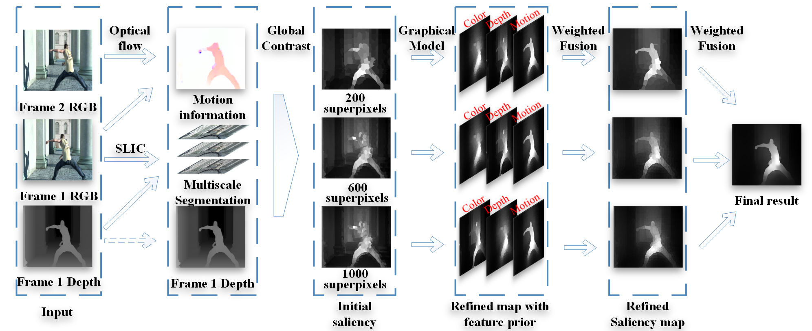

# Research Projects

## Graduation Thesis
"Saliency Detection based on GANs" \\
-Advised by Prof.Zhang

Generate Adversarial Networks (GANs) have a very good potential to handle the end-to-end problems and saliency detection is exactly one of them. Thus this project aims at upgrading my former method by using deep learning way to segment the saliency area from a 3D video sequence. This is also the topic of my graduation thesis, supervised by Prof. Ping Zhang.

## Saliency Detection based on Multi Scale and Graphical Model

-Advised by Prof.Zhang

We proposed an unsupervised saliency objects extraction method for 3D video. The proposed framework consists of three main stages: (i) The input video frame is segmented into non-overlapping superpixels by combining both appearance and depth information at the input. Depth information can be used to improve the accuracy of segmentation in complex regions, i.e., foreground object with similar appearance as background. A multi-scale segmentation scheme is also deployed by using different segmentation parameters to extract varying shapes of the foregrounds in each frame. (ii) The initial saliency score of each segmented superpixel in each scale is calculated via global contrast which is defined by appearance, depth, and motion cues from two consecutive frames. (iii) The initial saliency scores in each scale are refined by smoothing over a graph built by the spatial neighboring of all the superpixels in the frame. The final result is generated by fusing the saliency maps in all scales. This model also achieved unsupervised.

## Infrared Weak Target Detection based on CNN

Funded Engineering Project -- Advised by Prof.Zhang

Since the target is small and infrared, the feature of the target is very weak, which caused the great difficulty to recoginize the object. Thus a Convolutional Neural Networks was designed to utilize the limited feature with a high efficiency.

